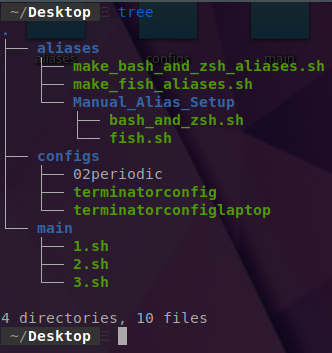
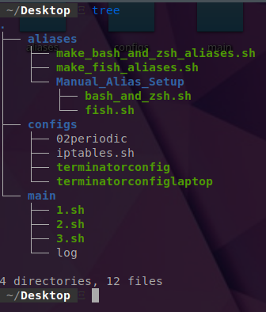
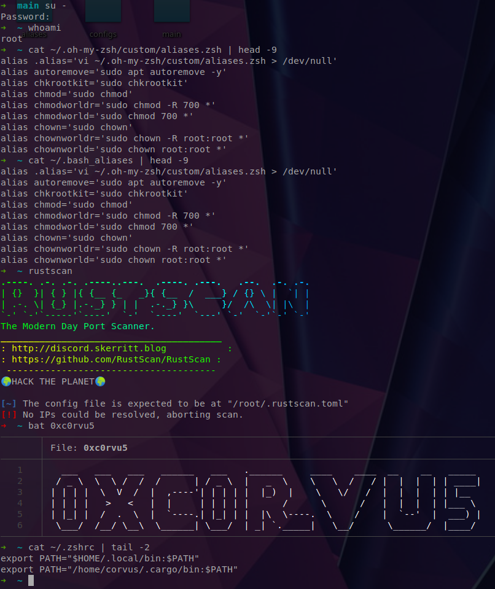
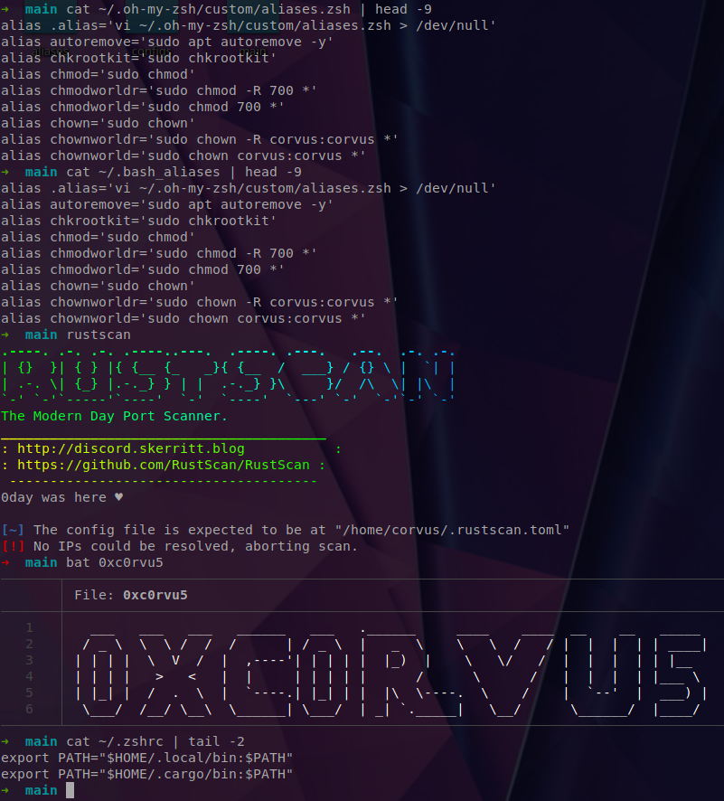
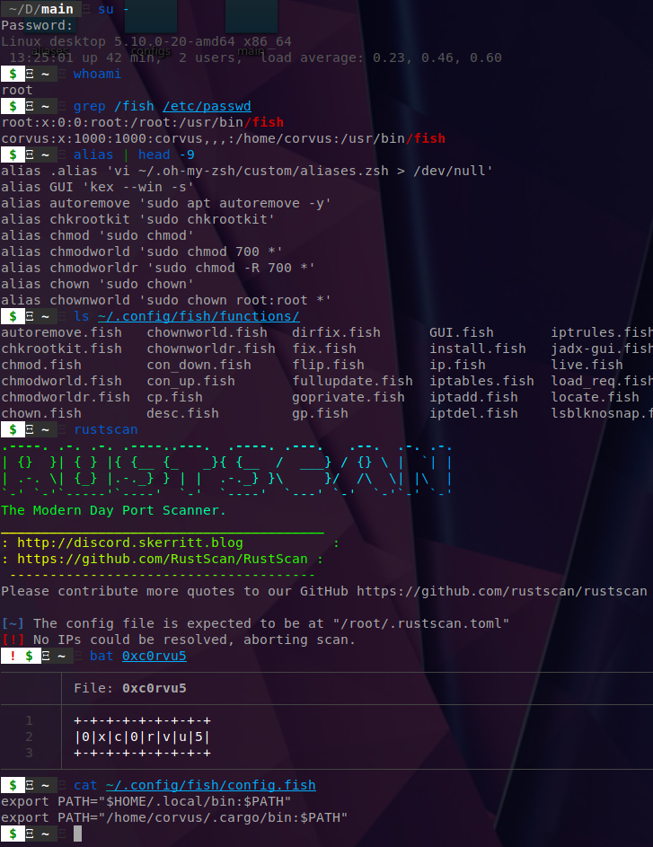
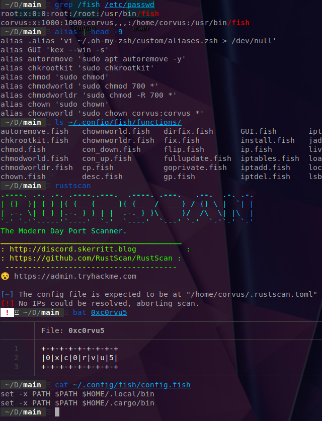
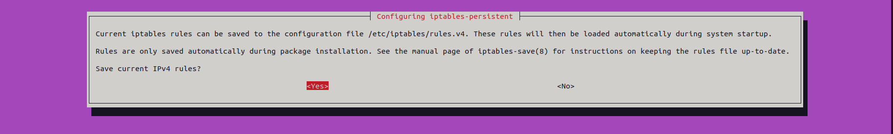
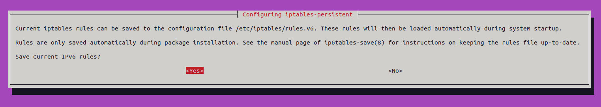
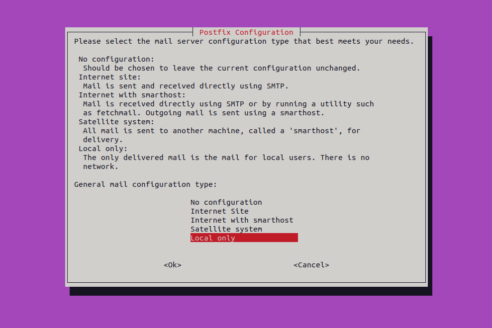
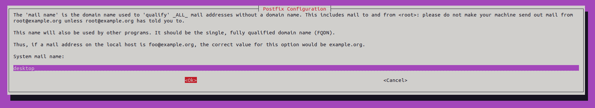

# Startup Script

## Install repo
```bash
git clone https://github.com/0xc0rvu5/Startup_Script && cd Startup_Script/main
```
### Final commands:

	- sudo ./1.sh
	- exit
	- ./2.sh
	- exit
	- sudo ./3.sh

### What it does:

	1.sh
		- Updates system
		- Installs necessary packages
			- apt-transport-https curl wget git xclip mlocate vim-gtk3 terminator zsh fish \
			bat tldr

	- Installs unecessary packages
		- toilet figlet cowsay fortune lolcat boxes

	- Adds iptables ruleset and creates a copy at ../configs/iptables.sh

	- Installs brave-browser
		- Adds files
			~ /usr/share/keyrings/brave-browser-archive-keyring.gpg 
		 	~ /etc/apt/sources.list.d/brave-browser-release.list
	
	- Installs VSCode
		- Adds files
			~ /usr/share/keyrings/packages.microsoft.gpg
			~ /etc/apt/source.list.d/vscode.list

	- Installs additional packages
		- libpam-tmpdir apt-listchanges debsums apt-show-versions sysstat auditd chkrootkit \
		rkhunter unhide fail2ban unattended-upgrades acct arpwatch shellcheck vlc xpad tor \
		sqlite3 sqlitebrowser python3-pip python3-virtualenv iptables-persistent

	- Activates unattended-upgrades
		- Creates a local file for /etc/apt/apt.conf.d/50unattended-upgrades here:
			~ /etc/apt/apt.conf.d/52unattended-upgrades-local
		- Copies ../config/02periodic to:
			~ /etc/apt/apt.conf.d/02periodic

	- Starts services on reboot:
		- arpwatch auditd fail2ban sysstat unattended-upgrades

	- Disables services on reboot:
		- cups cups-browsed ufw

	- Starts services immediately:
		- auditd fail2ban sysstat unattended-upgrades

	- Disables services immediately:
		- cups cups-browsed ufw

	- Adds a single arpwatch interface to monitor and adds ruleset to:
		~ /etc/arpwatch/your_interface.iface
			
		- Starts service on reboot and immediately after creating file

	- Adds auditctl ruleset to:
		~ /etc/audit/rules.d/audit.rules 

	- Adds banners to:
		~ /etc/motd
 		~ /etc/issue
 		~ /etc/issue.net

 	- Installs zsh/fish shell across all users
 		- Based on choice:
 			- For zsh installs:
 				- oh-my-zsh
			- For fish installs:
				- oh-my-fish

	2.sh
		- Installs rust
			- Installs rustscan
			- Installs feroxbuster

 	- Installs zsh/fish shell across all users
 		- Based on choice:
 			- For zsh installs:
 				- oh-my-zsh
			- For fish installs:
				- oh-my-fish

	3.sh
		- Updates `tldr` for root and any user(s) with the binary

 	- Creates directories at:
 		~ /root/.local/bin
 		~ /root/.local/share
 		~ /root/.config/terminator
 		~ /home/user/.local/bin
 		~ /home/user/.config/terminator

 	- Creates files at:
 		~ /root/.config/terminator/config
		~ /home/user/.config/terminator/config

	- Creates syslinks for `batcat`:
		~ ln -s /usr/bin/batcat /root/.local/bin/bat
		~ ln -s /usr/bin/batcat /home/user/.local/bin/bat

		- If Distribution ID is `Debian`:
			~ ln -s /usr/bin/batcat /usr/local/bin/bat

	- If the root and current user have a bash/zsh/fish shell then these paths will be appended to
	utilize ~/.cargo/bin ~/.local/bin binaries:
		~ export PATH="$HOME/.local/bin:$PATH"
		~ export PATH="/home/user/.cargo/bin:$PATH"

	- If the following files/directories are present in the root/user ~/ directories:
		~ ~/.bashrc
		~ ~/.oh-my-zsh
		~ ~/.config/fish

		- Create the relevant alias files for the user here:
			~ ~/.bash_aliases
			~ ~/.oh-my-zsh/custom/aliases.zsh
			~ ~/.config/fish/functions
			
	Log file at:
		~ log
		
		- Color coated:
			- Blue:
				- Content of file configurations
				
			- Green:
				- Installed packages
				
			- Green Background:
				- Time stamps at the beginning and end of each script
				
			- Red:
				- System service changes
				
			- Yellow:
				- File configurations
				
				
				
### Directory file structure before:


### Directory file structure after:


### Installing zsh and oh-my-zsh for root and user


#### Post zsh and oh-my-zsh install:
##### Root

##### User


### Installing fish and oh-my-fish for root and user


#### Post fish and oh-my-fish install:
##### Root

##### User


### Log file


### Initial install expect user input for `iptables-persistent` and `postfix` due to `rkhunter` installation




				

### Tested on:

	- Debian Buster 11 
	- Ubuntu 22.04 LTS

### Resources allotted on VM:

	- 16 GB RAM
	- 3 CPU Processors

### Completion time by script:

	1.sh
		- 3 min
	2.sh
		- 5 min
	3.sh
		- 10 sec
		
### References and inspiration from:
	- mttaggart
		- After completing the PMAT for TCM Security Michael got me hooked on the fish shell.

	- PimpMyKali
		- Some start up functions and ascii were referenced.

